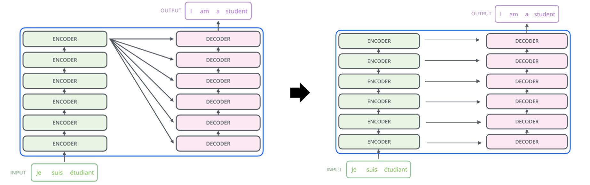

# transformer_research
My personal Transformer architecture research

## khsBERT
BERT pretrained by 'Korean Hate Speech Detection' (https://www.kaggle.com/c/korean-hate-speech-detection).

- Need to refactoring
- Need to arguments re-arange
- Need to data-free code (Now only for Korean Hate Speech; KHS)

## P-Transformer

Change Transformer network to Parallel mode. It inspired by Krashen's 'The Natural Order Hypothesis'.

- Plan to initiating
- Need data sequence